# Delta Sharing R vNext: requirements and implementation plan

Status: accepted architecture; execution tracked in `integration-roadmap.md`
Branch: `codex/delta-kernel-s7-overhaul`
Target package line: `delta.sharing` 0.2.x  
Date: 2026-07-28

This document describes the target architecture. The phase checklist,
integration rules, and completion gates live in `integration-roadmap.md`; the
canonical public interface lives in `s7-interface-naming-matrix.md`.

vNext is a clean break from prior package releases. The existing R6
implementation informs useful client/table/read terminology only. It is not a
public contract or a behavioral baseline, and vNext includes no aliases,
wrappers, deprecation layers, migration warnings, or prior-version parity
tests.

## 1. Executive recommendation

Rebuild the package around an R-first client and a narrow Delta Kernel bridge:

1. A small functional R API creates immutable client, table, read, and
   change-feed specifications.
2. S7 is the representation for those specifications because it
   provides formal classes, validation, generics, and S3 interoperability.
3. R owns profiles, authentication, HTTP, Delta Sharing protocol parsing,
   temporary Delta-log preparation, planning, diagnostics, and adapters.
4. Rust owns only Delta Kernel invocation and the Arrow/lifecycle state that
   must remain native while a Kernel stream is active.
5. The primary materialization is an Arrow C Stream exposed as a
   `nanoarrow_array_stream`.
6. `{arrow}` tables, DuckDB relations, and R data frames are adapters over that
   stream. The core package must never require a full-table data frame or a
   directory of downloaded Parquet files.
7. Delta-format reads use `delta-kernel-rs` and its default Arrow/Tokio engine.
   A deliberately narrow internal adapter isolates the package from the
   kernel's pre-1.0 Rust API changes.

The R/Rust bridge is a small registered C `.Call` shim over pure Rust
`extern "C"` status functions. Arrow data itself crosses the boundary through
the stable Arrow C Data/C Stream ABI, not through R vectors, an Arrow C++ ABI,
or per-batch serialization.

S7 adoption still requires a packaging/lifetime proof on every target platform,
but the proof is an implementation gate rather than an object-system selection
exercise.

The R-first boundary is fixed by `adr-003-rust-scope.md`. A responsibility may
move from R to Rust only after an optimized R implementation shows a dramatic
representative end-to-end performance or memory impact, followed by a separate
ADR and maintainer approval.

## 2. What informs this design

### Current R package

The current package:

- is an R6 client and mutable R6 table reader;
- parses requests and newline-delimited JSON in R;
- downloads every referenced Parquet file to local disk, sequentially;
- deletes and recreates local file state to make `arrow::open_dataset()` work;
- materializes a tibble by collecting an Arrow Dataset;
- implements its own Delta-to-Arrow type conversion;
- has no automated test suite or CI configuration in the repository;
- does not declare its R6 dependency in `DESCRIPTION`;
- duplicates `print.DeltaShareCredentials()`;
- currently fails `R CMD check` before code checks because required package
  metadata is not resolved.

This makes the existing code useful as a protocol sketch, but not as the
foundation for a kernel-backed high-performance reader.

### Recent Python work

The Python work in
[`delta-io/delta-sharing#860`](https://github.com/delta-io/delta-sharing/issues/860),
merged table handles in PR 862, and the current Arrow materializer work in
[`delta-io/delta-sharing#949`](https://github.com/delta-io/delta-sharing/pull/949)
establishes the right conceptual shape:

- `client -> table -> snapshot/changes -> materializer`;
- query configuration belongs to snapshot/change objects;
- table handles are reusable and cheap;
- Arrow is first-class;
- eager tables and lazy batches share one read path;
- pandas/data frames are adapters, not the only internal representation;
- snapshot and CDF implementations should be staged separately;
- shared scan setup should be factored out of individual materializers;
- Delta and Parquet response-format outputs should be tested for parity from
  the same fixtures;
- schema order, partition columns, casing, timestamps, limits, and temporary
  resource lifetimes require explicit tests.

The R API should preserve those ideas while using idiomatic functional calls
instead of copying Python method syntax mechanically.

## 3. Scope

### In scope for 0.2

- Delta Sharing profile versions 1 and 2.
- Bearer token, OAuth client credentials, JWT private-key client assertion, and
  basic authentication where supported by the current protocol/profile model.
- Share, schema, and table discovery with complete pagination.
- Table version, metadata, and protocol queries.
- Snapshot reads by latest version, explicit version, or timestamp.
- Change Data Feed reads by version or timestamp range.
- Delta and Parquet response formats.
- Delta Kernel-backed delta-format scans.
- Projection, exact client-side limit enforcement, and server predicate hints.
- Arrow C Stream, optional `{arrow}` table, and data-frame materializers.
- Direct composition with consumers that accept Arrow C Streams.
- Structured errors, cancellation, retries, diagnostics, and secret redaction.
- Cross-platform source builds and automated binary packaging.

### Explicit non-goals for 0.2

- Creating providers, shares, recipients, or credentials.
- Writing Delta tables.
- Spark or `sparklyr` execution.
- A full `dplyr` query translator.
- A persistent local Parquet cache.
- A custom Delta Kernel `Engine` unless the default engine cannot satisfy a
  hard requirement.
- Distributed execution.
- Promising CDF behavior that Delta Kernel itself does not support, such as
  unsupported schema evolution or column-mapped CDF ranges.

## 4. Functional requirements

### Profiles and authentication

- **FR-AUTH-01** Accept a profile file path, raw JSON, connection, or an
  explicitly constructed profile object.
- **FR-AUTH-02** Validate `shareCredentialsVersion` and reject newer versions
  with an actionable upgrade message.
- **FR-AUTH-03** Support version 1 bearer profiles and version 2 auth types used
  by the current Python connector.
- **FR-AUTH-04** Refresh OAuth credentials before expiry and serialize refreshes
  so concurrent requests do not stampede the token endpoint.
- **FR-AUTH-05** Never print, log, attach to conditions, or persist bearer
  tokens, client secrets, passwords, or private-key material.
- **FR-AUTH-06** Validate profile expiry before starting a scan, while still
  handling a token expiring during a long-running scan.
- **FR-AUTH-07** Allow a caller-supplied credential provider in a later minor
  release without changing the client/table/snapshot object model.

### Discovery and metadata

- **FR-DISC-01** List all shares, schemas, and tables and consume every page.
- **FR-DISC-02** Return compact base data frames with stable column names.
- **FR-DISC-03** Preserve provider names exactly; do not silently lowercase or
  otherwise normalize identifiers.
- **FR-DISC-04** Expose table version, protocol, metadata, and Arrow schema
  without reading table rows.
- **FR-DISC-05** Accept both `"share.schema.table"` and a structured identifier
  so dots and other edge cases can be supported without another API rewrite.

### Snapshot specification

- **FR-SNAP-01** A table handle creates a latest, versioned, or timestamped
  snapshot specification.
- **FR-SNAP-02** Version and timestamp are mutually exclusive and validated
  before network I/O.
- **FR-SNAP-03** Projection is represented explicitly as a character vector and
  is pushed into Delta Kernel.
- **FR-SNAP-04** `limit` is sent as a server hint and enforced exactly by the
  client after scanning.
- **FR-SNAP-05** Structured JSON predicate hints are preferred over deprecated
  SQL predicate hints.
- **FR-SNAP-06** Predicate hints remain documented as best-effort. If the
  package later exposes an exact row-filter API, it must apply the residual
  predicate after kernel/file pruning.
- **FR-SNAP-07** `response_format = "auto"` negotiates
  `delta,parquet`, preferring delta when required for advanced features.
- **FR-SNAP-08** Explicit `response_format = "delta"` may accept a protocol
  Parquet response when the server selects it, but reports the actual chosen
  format in diagnostics.
- **FR-SNAP-09** Empty tables return a zero-batch stream with the correct
  logical Arrow schema.

### Change Data Feed

- **FR-CDF-01** A table handle creates a change specification with one starting
  bound and an optional ending bound.
- **FR-CDF-02** Version and timestamp bounds cannot be mixed within a range.
- **FR-CDF-03** Delta-format CDF requests historical metadata as required to
  reconstruct the version range.
- **FR-CDF-04** Output includes `_change_type`, `_commit_version`, and
  `_commit_timestamp` with stable Arrow types.
- **FR-CDF-05** Unsupported kernel combinations fail before data materialization
  with a condition identifying the unsupported reader feature or schema change.
- **FR-CDF-06** Snapshot and CDF use the same Arrow stream and materializer
  interfaces, but separate internal planners and tests.

### Materialization and interoperability

- **FR-MAT-01** `read_arrow_stream()` is the primary, always-available row
  materializer and returns a `nanoarrow_array_stream`.
- **FR-MAT-02** The stream is lazy, bounded, single-consumer, explicitly
  releasable, and safe when abandoned early or garbage-collected.
- **FR-MAT-03** `read_arrow()` is available when `{arrow}` is installed and
  consumes the C Stream without an IPC or R-vector round trip.
- **FR-MAT-04** `read_data_frame()` and `as.data.frame()` are eager convenience
  adapters and clearly document their memory cost.
- **FR-MAT-05** Materializers require an explicit read descriptor;
  `sharing_read(table)` is the concise latest-snapshot form.
- **FR-MAT-06** Schema, field order, nullability, nested types, decimals, binary,
  dates, `timestamp[us, UTC]`, timestamp-without-timezone, partition values, and
  column mapping are preserved according to Delta Kernel semantics.
- **FR-MAT-07** Stream errors that occur after some batches have been consumed
  are raised on the next pull with the original structured condition metadata.
- **FR-MAT-08** Releasing a stream cancels outstanding work and releases its
  temporary log, HTTP requests, Arrow buffers, and kernel objects.

### Diagnostics and clean-break policy

- **FR-DIAG-01** Expose the selected response format, table version, projected
  schema, files considered/read/skipped, rows/batches emitted, bytes read,
  retries, elapsed stages, and effective concurrency.
- **FR-DIAG-02** Diagnostics never contain signed URLs or credentials.
- **FR-BREAK-01** The canonical interface is the one recorded in
  `s7-interface-naming-matrix.md`.
- **FR-BREAK-02** Do not export prior R6 classes, setters, URL-concatenation
  helpers, constructor aliases, or transition wrappers.
- **FR-BREAK-03** Do not add deprecation warnings, migration behavior, or tests
  whose only purpose is reproducing an earlier package release.

## 5. Non-functional requirements

### Performance

- **NFR-PERF-01** A streaming scan must not download complete Parquet files to a
  package-managed directory before Arrow can consume them.
- **NFR-PERF-02** For 64K-row-or-larger batches, R/FFI overhead should be less
  than 2% of the same Rust-only scan in a controlled benchmark.
- **NFR-PERF-03** End-to-end Arrow stream throughput should reach at least 90%
  of the Rust-only Delta Kernel baseline on the same machine and fixture.
- **NFR-PERF-04** Peak resident memory for a streaming scan must be bounded by
  configured in-flight batches plus fixed engine overhead, not total table
  size.
- **NFR-PERF-05** The default pipeline should have bounded prefetch and
  backpressure. Faster producers must not fill memory while R is idle.
- **NFR-PERF-06** Concurrency and batch size are configurable but have safe
  automatic defaults.
- **NFR-PERF-07** Metadata/listing calls reuse pooled HTTP connections and an
  authenticated client.
- **NFR-PERF-08** The implementation must avoid R callbacks and R object access
  from Rust worker threads.

### Correctness and reliability

- **NFR-COR-01** Delta-format feature semantics are delegated to Delta Kernel,
  not reimplemented in R.
- **NFR-COR-02** Unsupported features fail closed; never silently return rows
  that should have been removed by deletion vectors or column mapping.
- **NFR-COR-03** Retries honor server backoff headers, use jittered exponential
  backoff, and are limited to idempotent/replayable operations.
- **NFR-COR-04** A stream can be cancelled by explicit release or R interrupt.
- **NFR-COR-05** Temporary log construction is atomic and cleaned after success,
  error, cancellation, early release, and garbage collection.
- **NFR-COR-06** All public errors inherit from `delta_sharing_error` and a
  narrower class such as auth, HTTP, protocol, kernel, unsupported, or
  cancelled.

### Portability and packaging

- **NFR-PKG-01** Support macOS arm64/x86_64, Linux x86_64/arm64, and Windows
  x86_64.
- **NFR-PKG-02** Pin a tested Rust MSRV and enforce it in CI.
- **NFR-PKG-03** Commit `Cargo.lock`; vendor Rust dependencies for CRAN/source
  builds when release policy requires it.
- **NFR-PKG-04** Build Rust as a static library linked into the R package shared
  object; users of binary R packages do not need Rust installed.
- **NFR-PKG-05** Import `nanoarrow`; keep the large `{arrow}` R package and
  DuckDB in `Suggests`.
- **NFR-PKG-06** Pin a Delta Kernel minor release. Upgrades require the full
  protocol, conformance, lifetime, and benchmark suite.
- **NFR-PKG-07** Use Apache-2.0 package licensing, with complete dependency
  notices and no placeholder license field.

## 6. Proposed public API

The API is functional first. S7 classes provide validation and dispatch, but
users do not need to manipulate properties with `@`.

```r
client <- sharing_client("recipient.share")
orders <- sharing_table(
  client,
  share = "sales",
  schema = "default",
  table = "orders"
)

latest <- sharing_read(
  orders,
  columns = c("order_id", "ordered_at", "amount"),
  limit = 1e6,
  response_format = "auto"
)

stream <- read_arrow_stream(latest)
arrow_table <- read_arrow(latest)
data <- read_data_frame(latest)

cdf <- sharing_changes(
  orders,
  starting_version = 120L,
  ending_version = 125L
)
cdf_stream <- read_arrow_stream(cdf)
```

The complete annotated mock is in `design/api-mock.R`.

### Proposed classes

- `SharingProfile`: validated non-secret profile metadata and an internal
  credential source.
- `SharingClient`: endpoint plus an internal R-owned authenticated client
  context.
- `SharingTable`: client reference plus structured table identifier.
- `SharingRead`: projection, predicates, limit, time travel, response format.
- `SharingChanges`: CDF range, projection, response format.
- `SharingReadDiagnostics`: immutable safe snapshot of stream diagnostics.

The objects should be cheap descriptors. The only stateful user-visible object
is the returned nanoarrow stream.

## 7. Object-system decision

| Criterion | S3 | R6 | S7 |
|---|---|---|---|
| Maturity | Excellent | Excellent | New; explicitly still experimental |
| Formal property validation | Manual | Manual/private fields | Built in |
| Functional/piped API | Natural | Possible but secondary | Natural |
| Mutable external state | Manual external pointer | Natural | Keep outside objects |
| Extension through generics | Broad but informal | Method inheritance | Formal generics and methods |
| S3 ecosystem interop | Native | Requires methods/wrappers | Designed for S3 interop |
| API introspection/contracts | Weak | Moderate | Strong |
| Risk of dependency churn | Low | Low | Moderate |
| Hot-path performance impact | Negligible | Negligible | Negligible |

### Decision

Use S7 for immutable high-level descriptors and external generics, with S3
methods for base interoperability such as `print()` and `as.data.frame()`.
Do not use an S7 environment base type or S7 property mutation for execution
state. S7's environment base is experimental, and mutable scan state belongs in
the narrow Kernel/nanoarrow boundary.

Do not continue with R6 as the primary public API. R6 fits a mutable client but
encourages query options and materialization state to accumulate on one object,
which is precisely the coupling the Python work is removing.

Do not expose bare S3 because snapshot and CDF specifications have enough
invariants that formal construction is valuable. S3 methods remain appropriate
for established external generics such as `print()` and `as.data.frame()`.

### Required implementation proof

Before production implementation:

1. Define the public classes and generics in S7.
2. Prove the R-owned client context does not leak mutable state through public
   properties.
3. Verify package load/unload, documentation generation, `R CMD check`,
   garbage collection, and S3 `print()`/`as.data.frame()` registration on the
   minimum supported R.
4. Separately verify the native Kernel stream lifecycle cases on macOS, Linux,
   and Windows.

This proof is a Phase 1 gate. It is not permission to begin the full reader
before lifecycle failures are resolved.

## 8. Target architecture

```mermaid
flowchart LR
    API["R functional API + S7 descriptors"]
    CLIENT["R profiles, auth + HTTP"]
    PLAN["R snapshot/CDF planner"]
    PROTOCOL["R Delta Sharing NDJSON parser"]
    LOG["R-prepared synthetic Delta log"]
    FFI["narrow Kernel FFI"]
    KERNEL["delta-kernel-rs adapter"]
    ENGINE["Default Arrow/Tokio engine"]
    STREAM["Rust RecordBatchReader"]
    CABI["Arrow C Stream ABI"]
    NANO["nanoarrow_array_stream"]
    CONSUMERS["arrow / DuckDB / data.frame / other consumers"]

    API --> CLIENT
    CLIENT --> PLAN
    PLAN --> PROTOCOL
    PROTOCOL --> LOG
    LOG --> FFI
    FFI --> KERNEL
    KERNEL --> ENGINE
    ENGINE --> STREAM
    STREAM --> CABI
    CABI --> NANO
    NANO --> CONSUMERS
```



### R layer responsibilities

- constructors, validation, printing, and discoverable help;
- profile parsing, credentials, refresh, authenticated HTTP, retry, and
  pagination;
- capability negotiation and incremental Delta Sharing response parsing;
- snapshot/CDF planning and atomic synthetic-log preparation;
- translating a prepared log and validated options into a compact Kernel
  invocation;
- allocating a nanoarrow stream destination;
- optional adapters to `{arrow}` and base data frames;
- structured R conditions, redaction, and public diagnostics.

R parses large NDJSON responses incrementally rather than collecting them as
one string or data frame. R must not download complete data files before
scanning or transform record batches column by column.

### Minimal Rust modules

Proposed internal layout:

```text
src/
  entrypoint.c
  Makevars
  Makevars.win
  rust/
    Cargo.toml
    Cargo.lock
    src/
      lib.rs
      errors.rs
      metrics.rs
      kernel/
        mod.rs
        adapter.rs
        arrow_reader.rs
      ffi/
        mod.rs
        arrow_stream.rs
```

The `kernel/adapter.rs` module is the only module allowed to depend directly on
unstable Delta Kernel concrete APIs. The rest of the package depends on an
internal trait such as:

```text
KernelReader::snapshot(spec) -> RecordBatchReader
KernelReader::changes(spec)  -> RecordBatchReader
```

There are no Rust auth, client, HTTP, protocol, discovery, retry,
synthetic-log, or standalone Parquet modules. Adding one requires the
performance exception process in ADR 003.

## 9. Delta Sharing and Delta Kernel integration

### Capability negotiation

For snapshot delta-format reads, advertise the features actually implemented
and tested by the pinned kernel, initially:

```text
responseformat=delta,parquet;
readerfeatures=deletionvectors,columnmapping,timestampntz
```

CDF has a separate capability set because Delta Kernel's current CDF support is
narrower. Never advertise a reader feature merely because it exists in the
protocol. Capability values must come from a tested allowlist tied to the
pinned kernel release.

### Snapshot flow

1. Validate the read specification in R.
2. Query metadata/capabilities from R if `response_format = "auto"` needs
   resolution.
3. POST the table query from R with projection-independent server hints.
4. Parse response headers and NDJSON incrementally in R.
5. In R, create a private temporary table root and write a
   minimal `_delta_log` whose protocol, metadata, and actions preserve the
   signed data/DV URLs.
6. Pass the prepared log and compact validated scan options to Rust.
7. Open a Delta Kernel snapshot and build a projected scan in the narrow
   adapter.
8. Execute through the default engine and expose its Arrow batches through one
   reader.
9. Enforce the residual limit at the Kernel/Arrow reader boundary.
10. Keep the R-prepared temporary log alive until the stream is released.

The synthetic log is a pragmatic first implementation and follows the protocol
design and current Python connector. A custom in-memory kernel engine is not
justified until measurement shows temporary log I/O is material.

### Protocol Parquet response flow

Servers can return Parquet-format actions. R normalizes those actions into the
same Kernel-readable preparation and returns the same Arrow stream:

1. Parse metadata and file actions incrementally in R.
2. Prepare a minimal synthetic log that preserves signed object URLs and
   logical metadata.
3. Pass that prepared log through the same narrow Kernel invocation.
4. Let Delta Kernel reconstruct partition columns and logical field
   order/types.
5. Apply projection and exact limit at the Kernel/Arrow reader boundary.
6. Emit record batches through the same C Stream boundary.

This is a supported Delta Sharing response format, not a second public reader
architecture, a standalone Rust Parquet reader, or a prior-package
compatibility path.

### Change Data Feed flow

CDF reconstruction is separate:

1. Stream protocol, historical metadata, and per-version actions in R.
2. Write the minimal versioned log required by
   `TableChanges`/`TableChangesScanBuilder` in R.
3. Validate the entire requested range in R against pinned-kernel limitations.
4. Pass the prepared log and CDF scan options through the narrow Kernel bridge.
5. Execute into the same Arrow stream abstraction.

Known kernel limitations must be tested and surfaced. For example, current
Delta Kernel documentation disallows column-mapped CDF and requires compatible
schemas across the range.

## 10. Arrow boundary and resource ownership

The Arrow C Stream interface is the critical performance contract.

1. Rust obtains a `Box<dyn RecordBatchReader + Send>`.
2. The Arrow Rust crate exports it as `FFI_ArrowArrayStream`.
3. R allocates a `nanoarrow_array_stream` destination.
4. A narrow native call moves the Rust stream into that destination.
5. nanoarrow owns the C Stream release callback.
6. `{arrow}` or another consumer imports the same buffers without IPC
   serialization and, where types allow, without copying.

### Lifetime rules

- The stream private data owns the Kernel scan, an optional guard for the
  R-prepared temporary log, Kernel cancellation token, and native metrics.
- Each emitted array owns or retains the buffers it references until the
  consumer calls its release callback.
- Stream release cancels the producer and drops unconsumed batches.
- Pulling after release is an error.
- A stream is single-consumer and not serializable.
- Rust worker threads never retain an R object or call the R API.
- R interruption is checked on the owning R thread between batch pulls and
  converted to cancellation.
- Panic must never cross the FFI boundary.

Using the C Stream ABI also decouples the Rust Arrow crate version selected by
Delta Kernel from the version of the optional R `{arrow}` package.

## 11. Concurrency and memory model

- Use one lazily initialized Tokio runtime per R process, guarded by process ID
  so a forked child cannot reuse parent Kernel threads.
- Use R HTTP tooling with connection reuse for authenticated protocol calls.
- Stream NDJSON incrementally in R and record batches in Rust; never collect an
  entire table response solely for convenience.
- Feed a bounded synchronous Arrow reader from a bounded async producer queue.
- Default queue capacity: two record batches; configurable for benchmarks.
- Default file-read concurrency: derived from CPU count and a conservative
  upper bound, with an explicit option for constrained environments.
- Apply backpressure when R or a downstream engine stops pulling.
- R owns control-plane interruption; the native cancellation token covers
  Kernel execution and the batch producer.
- Make batch size and concurrency observable in diagnostics.
- Reuse buffers where Arrow/Kernel permits; do not concatenate batches unless
  the caller requests an eager table/data frame.

## 12. Error model

R conditions:

```text
delta_sharing_error
  delta_sharing_auth_error
  delta_sharing_http_error
  delta_sharing_protocol_error
  delta_sharing_kernel_error
  delta_sharing_unsupported_error
  delta_sharing_cancelled
```

Each condition may include safe fields such as operation, HTTP status, endpoint
host, retry count, table identifier, and kernel error category. Bodies,
authorization headers, signed URLs, tokens, secrets, and private-key paths are
redacted.

Only Kernel/native errors cross the FFI boundary, and they remain typed until
R maps them to public conditions. Auth, HTTP, protocol, and planning errors are
created directly in R.

## 13. Test strategy

### Rust unit tests

- compact Kernel invocation validation;
- Kernel snapshot and CDF adapter behavior;
- exact limit behavior across batch boundaries;
- Kernel error payload safety;
- cancellation and early drop;
- Arrow C Stream release after zero, one, and many batches.

### R unit tests

- S7 constructors, validators, print methods, and generic dispatch;
- mutually exclusive snapshot/CDF options;
- profile-source forms;
- every auth type, expiry, and single-flight token refresh;
- pagination and retry/backoff classification;
- NDJSON split at every possible buffer boundary;
- capability negotiation and response-format detection;
- synthetic snapshot/CDF log generation;
- public error redaction;
- optional `{arrow}` behavior;
- `as.data.frame()` behavior and memory warning documentation;
- structured condition classes;
- stream release and garbage collection.

### Protocol and kernel fixtures

The same fixture cases must exercise Arrow stream, Arrow table, and data-frame
outputs:

- empty table;
- unpartitioned and multi-column partitioned tables;
- partition column in the middle of logical schema order;
- case differences between logical, physical, and partition names;
- every primitive Delta/Arrow type;
- nested struct, list, and map types;
- decimals and binary;
- timestamp UTC microseconds and timestamp without timezone;
- column mapping by name and ID;
- inline and on-disk deletion vectors;
- missing columns/null filling;
- explicit version and timestamp snapshots;
- exact limits smaller than, equal to, and larger than a batch;
- CDF insert/update/delete;
- CDF schema incompatibility and unsupported column mapping;
- truncated/malformed NDJSON and missing required headers;
- expired signed URLs and retry/refresh behavior.

### Parity and conformance

- Compare output against the Python connector for shared fixtures.
- Run Delta Kernel acceptance fixtures relevant to reads.
- Assert Arrow schemas directly; data-frame equality alone is insufficient.
- Test a downstream DuckDB Arrow registration without copying through a data
  frame.

### CI matrix

- R minimum, current, and devel.
- macOS arm64 and x86_64.
- Ubuntu x86_64 and arm64.
- Windows x86_64.
- Rust MSRV and current stable.
- Optional `{arrow}` absent and present.
- Sanitizer/Miri-style native checks where compatible, plus valgrind or
  equivalent R native checks on a scheduled job.

## 14. Benchmark plan and gates

### Fixtures

- metadata-only table with 10,000 files;
- 1 GB and 10 GB scans with few large files;
- 1 GB scan with many small files;
- partition-prunable and non-prunable predicates;
- wide and nested schemas;
- deletion vectors at low and high cardinality;
- CDF across short and long version ranges.

### Measurements

- time to first batch;
- steady-state rows/s and compressed/uncompressed MB/s;
- peak RSS;
- allocations and copies at the FFI boundary;
- CPU utilization;
- network concurrency;
- files/row groups skipped;
- early-stop latency for `limit`;
- cancellation latency;
- eager conversion cost separated from scan cost.

### Baselines

Compare:

1. Rust-only Delta Kernel executable;
2. new R nanoarrow stream;
3. new R `{arrow}` table;
4. new R data frame;
5. Python Arrow reader on the same protocol fixture.

Controlled microbenchmarks should gate regressions. Noisy cloud/object-store
benchmarks should publish trend artifacts and require review rather than fail
every pull request.

### Rust-scope exception benchmark

An isolated Rust implementation beating R is not sufficient to expand the
native boundary. The optimized R implementation and Rust prototype must run in
the same representative end-to-end workflow. Expansion is eligible for review
only at a measured 25% end-to-end wall-clock improvement or 50% peak-memory
reduction, followed by the separate ADR and maintainer approval required by
ADR 003.

## 15. Implementation phases

### Phase 0: decisions and build skeleton

- Repair package metadata and license.
- Record minimum R/Rust/platform decisions.
- Prove S7 packaging, dispatch, and lifecycle behavior on target platforms.
- Complete a Rust-to-nanoarrow one-batch/empty/error stream spike.
- Add CI and package/Rust formatting and linting.
- Produce ADRs before reader implementation.

Exit: package checks cleanly; C Stream lifetime tests pass on all primary
platforms; the accepted S7 interface passes its package proof.

### Phase 1: profile, client, and discovery

- Implement the R profile/auth/client core.
- Implement S7 descriptors and R discovery functions.
- Add pagination, retry, redaction, and metadata tests.
- No row reading yet.

Exit: authenticated discovery and table metadata/version are production tested.

### Phase 2: snapshot delta-format stream

- Implement capability negotiation and incremental NDJSON parsing in R.
- Build the synthetic snapshot log in R.
- Integrate pinned Delta Kernel through the adapter.
- Return a lazy nanoarrow stream.
- Cover projection, limits, empty tables, column mapping, deletion vectors, and
  timestamps.

Exit: snapshot stream meets correctness and performance gates.

### Phase 3: materializers and composition

- Add optional `{arrow}` table and base data-frame adapters.
- Add DuckDB composition example.
- Add metrics/diagnostics.

Exit: one scan path powers every materializer and examples.

### Phase 4: CDF

- Implement separate CDF planner/log builder.
- Add CDF stream and adapters.
- Encode kernel limitations as capability checks and actionable errors.

Exit: supported CDF fixtures pass across all materializers and platforms.

### Phase 5: protocol Parquet response

- Normalize Parquet actions into an R-prepared Kernel-readable log.
- Reuse the narrow Kernel/Arrow bridge; do not add a standalone Rust reader.
- Reconstruct partition values and schema normalization through the prepared
  log and Kernel semantics.
- Prove parity with the delta-format path where both are available.

Exit: supported servers that select Parquet work without restoring the old
download-to-directory design.

### Phase 6: hardening and release

- Finish security review, dependency audit, notices, and vendoring.
- Run full conformance and benchmark suites.
- Build/test binaries.
- Publish vNext reference documentation and vignettes.
- Release 0.2.0 as an explicit pre-1.0 architectural rewrite.

## 16. Proposed commit/PR boundaries

Keep reviews small and preserve the lesson from the Python PR:

1. Package metadata, test/CI skeleton, and ADRs.
2. S7 public descriptors and R client/discovery API.
3. R auth, protocol, and synthetic-log preparation.
4. Minimal Arrow C Stream bridge and lifecycle tests.
5. Delta Kernel snapshot adapter.
6. Snapshot materializers and parity tests.
7. R diagnostics and benchmarks.
8. R CDF planner/log plus Kernel scan.
9. R Parquet-action preparation plus Kernel scan.
10. Docs and release packaging.

Do not mix snapshot and CDF implementations in one review.

## 17. Risks and mitigations

| Risk | Impact | Mitigation |
|---|---|---|
| S7 changes before reaching long-term stability | Public API churn | Pin a tested S7 release; keep normal use behind exported functions |
| Delta Kernel 0.x API churn | Frequent Rust breakage | Pin minor version; isolate adapter; upgrade only with full suite |
| Arrow/Rust version mismatch | Build or memory errors | Cross only the stable Arrow C ABI; never link to Arrow R C++ |
| Stream lifetime bug | Crash or use-after-free | Single owner, release callbacks, early-drop/GC/error tests |
| Tokio and R fork interaction | Deadlock/crash in forked child | Lazy PID-guarded runtime; documented fork behavior |
| Signed URL expiry during long scan | Mid-stream failure | expiry-aware planning, bounded retries, refresh-token support |
| CDF kernel limitations | Incomplete feature promise | advertise only tested features; fail fast with typed condition |
| Rust source build burden | Installation failures | vendoring, MSRV, CI matrix, release binaries |
| R control-plane performance | User-visible latency or memory cost | optimize/profile R first; expand Rust only through ADR 003's end-to-end threshold |
| Exact filter semantics confused with hints | Incorrect rows | name hints explicitly; exact API must apply residual predicate |
| Large eager conversion | R out-of-memory | stream is primary; eager adapters documented and measured |

## 18. Decisions to confirm before Phase 1

Recommended defaults are in parentheses:

1. Public object system (**S7, accepted**).
2. Functional API versus R6 method chaining (**functional**).
3. Rust bridge (**registered C control shim plus pure Rust Arrow C ABI,
   accepted**).
4. Rust scope (**Delta Kernel and Kernel-coupled Arrow/lifecycle glue only,
   accepted**).
5. Minimum R version (**R 4.3**, unless a target Databricks Runtime requires
   4.2; the functional API can support either).
6. Distribution: GitHub/R-universe binaries first, then CRAN (**staged**).
7. Prior package compatibility (**none, accepted**).
8. Automatic format preference (**negotiate delta,parquet and let the server
   choose, with advanced features forcing delta**).

## 19. Primary technical references

- [Delta Sharing protocol](https://github.com/delta-io/delta-sharing/blob/main/PROTOCOL.md)
- [Delta Sharing Python object/Arrow proposal](https://github.com/delta-io/delta-sharing/issues/860)
- [Current Python Arrow materializer PR](https://github.com/delta-io/delta-sharing/pull/949)
- [Delta Kernel Rust crate](https://docs.rs/crate/delta_kernel/latest)
- [Delta Kernel snapshot scan API](https://docs.rs/delta_kernel/latest/delta_kernel/scan/struct.Scan.html)
- [Delta Kernel CDF API and current limitations](https://docs.rs/delta_kernel/latest/delta_kernel/table_changes/struct.TableChanges.html)
- [Arrow C Data and Stream interface](https://arrow.apache.org/docs/format/CDataInterface.html)
- [nanoarrow R interface](https://arrow.apache.org/nanoarrow/latest/getting-started/r.html)
- [S7 overview](https://rconsortium.github.io/S7/)
- [Using S7 in a package](https://rconsortium.github.io/S7/articles/packages.html)
- [Writing R Extensions: registering native routines](https://cran.r-project.org/doc/manuals/r-release/R-exts.html#Registering-native-routines)
